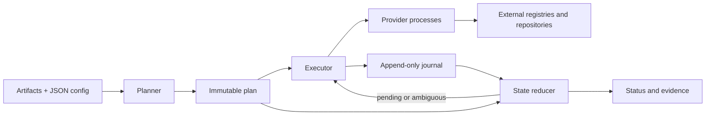

# Architecture

Distroplane separates release intent from execution. The Go core models artifacts, plans, execution state, and evidence. Package-specific APIs live in separate provider executables. The module uses only the Go standard library.

The CLI drives this lifecycle. The GitHub Action installs and invokes the CLI; publication logic remains in providers.

## Plan

Configuration is versioned JSON. Provider configuration is opaque to the core. Planning hashes artifacts and provider executables, calls provider `describe` and `plan`, validates the operation DAG, and writes a content-addressed plan.

The saved plan contains absolute artifact paths and is not a portable artifact bundle. Core artifact source paths are excluded from semantic plan identity, while paths inside provider configuration or payloads remain part of provider intent.

## Execution and recovery

The executor runs ready operations with bounded concurrency, attempts, leases, timeouts, and stable idempotency keys. Before a side-effecting provider request is released, its dispatch boundary is durably journaled. If the result is then unknown, the operation requires reconciliation before another publication attempt.

The journal stores length-delimited, checksummed JSON events. Successful appends synchronize the file and writers hold an OS file lock. An incomplete final frame can be discarded on reopen; corruption in a complete frame is rejected. Parent-directory synchronization is used on Unix and skipped on Windows.

`status` derives state only from the plan and journal. `reconcile` asks providers to observe pending or ambiguous work; it does not publish new content or refresh completed targets. There is no daemon, distributed worker service, universal rollback, or exactly-once publication guarantee.

## Provider protocol

Each provider invocation reads one UTF-8 JSON request from stdin, writes one response to stdout, and exits. Diagnostics use stderr. The host bounds output, applies deadlines, checks provider identity/version/capabilities, verifies executable digests for execution, and supplies an allowlisted runtime environment plus declared credentials.

| Operation | Purpose |
| --- | --- |
| `describe` | Identity, protocol versions, capabilities |
| `plan` | Validate target configuration and return immutable operations |
| `apply` | Execute a planned operation |
| `reconcile` | Observe existing external state without new publication |

Protocol v1 is [candidate](../protocol/schema/v1/compatibility.json). Unknown protocol fields are ignored; unsupported versions, operations, and capabilities are rejected. The [schema](../protocol/schema/v1/protocol.schema.json) and [examples](../protocol/examples/v1/messages.json) define the wire format.

## Evidence

Evidence export replays the journal and records release/artifact identity, provider versions, plan/run IDs, target and operation state, external references, provider evidence, and the journal digest. Export does not query destinations or create/verify signatures. Provider guides define what each provider result proves.
