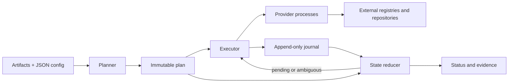

# Architecture and provider protocol

Distroplane separates release intent from execution. The Go core models artifacts, targets, operations, state, and evidence. Package formats and remote APIs live in separate provider executables. The module uses only the Go standard library.

The native CLI drives this lifecycle. The GitHub Action installs and invokes that CLI and optionally uploads its outputs; it contains no provider publication logic.

## Configuration and planning

The configuration loader validates versioned JSON and resolves artifact paths. Provider configuration stays opaque to the core. The planner hashes local artifacts and provider executables, calls `describe` and `plan`, validates the operation DAG, and writes a content-addressed plan.

Plan identity includes release identity, artifact digests/sizes, provider identities/versions/digests, target configuration, requirements, and planned operations. Timestamps, host identity, and core artifact source paths are excluded. Paths embedded in provider configuration or payloads remain part of identity; npm's absolute tarball path is one example. Equivalent formatting and target ordering are normalized.

The saved plan contains absolute artifact paths for execution. It is not a portable artifact bundle. The current configuration has no cross-target dependency field; providers can declare dependencies among their own planned operations.

## Execution, journal, and state

The local executor schedules ready operations with bounded concurrency and explicit attempts, leases, timeouts, and stable idempotency keys. It journals provider start and dispatch boundaries before letting a request reach the provider. A lease expiry or missing response does not prove a side effect failed: dispatched work with an unknown outcome requires reconciliation.

The journal is a sequence of length-delimited, checksummed JSON events. Appends are acknowledged after file synchronization; writers hold an OS file lock. An incomplete final frame can be discarded on reopening; corruption in complete frames is rejected. Parent-directory synchronization is used on Unix and skipped on Windows.

The reducer derives current state from the immutable plan and journal. Status does not contact external services. Reconcile invokes providers for pending or ambiguous operations and records their observations. It does not publish new content or refresh already completed targets. There is no daemon, distributed worker service, or universal rollback operation.

## Provider protocol

Each invocation handles one UTF-8 JSON request on stdin and one response on stdout, then exits. Diagnostics belong on stderr. Requests/responses carry the string protocol version `"1"`, request ID, operation, and payload; responses also carry a status or structured error. Process exit status describes transport health, while the response describes publication state.

| Operation | Contract |
| --- | --- |
| `describe` | Report provider name/version, supported protocols, and capabilities; no publication side effects |
| `plan` | Validate configuration and return immutable actions and requirements; no publication side effects |
| `apply` | Execute a planned action with an idempotency key and explicit attempt |
| `reconcile` | Observe existing external state using saved intent and prior evidence; no new release publication |

The host bounds protocol output and diagnostics, applies deadlines, and checks identity/version/capabilities. Credential resolution supplies the invoked provider's declared requirements, but discovery/planning and execution identity checks currently inherit the parent environment on Linux/macOS. See the [security model](security-model.md#provider-execution-and-credentials) for this isolation limitation and per-provider job guidance.

Protocol v1 is still marked **candidate** in the [compatibility manifest](../protocol/schema/v1/compatibility.json). Unknown protocol fields are ignored; unknown operations/capabilities and unsupported versions are rejected. This differs from configuration and saved-plan parsing, which reject unknown core fields.

For provider authors, the [JSON schema](../protocol/schema/v1/protocol.schema.json) and [message examples](../protocol/examples/v1/messages.json) define the wire shape. No Go SDK or Distroplane import is required. Return evidence with `PUBLISHED`, `WAITING_EXTERNAL`, or `REJECTED`; report failures through the structured error taxonomy. Never log secrets or write diagnostics to stdout.

Repository compatibility tests run with `go test ./internal/protocol`; host contract tests run with `go test ./internal/providerhost`. The fake provider demonstrates configurable pending, failure, and ambiguous outcomes. These are repository tests, not a standalone third-party certification tool.

## Evidence

Evidence export replays the journal and records release identity, artifact hashes, provider versions, plan/run IDs, per-target and per-operation state, observation times, external references, and the journal's digest. It preserves provider-specific evidence alongside normalized states.

The bundle describes what was recorded, not a new remote observation. Its strength depends on each provider: SDKMAN acceptance and WinGet merge/branch observations have different meanings. Consult the provider guides. Attestation inputs attach external references; the core does not create or verify signatures.
